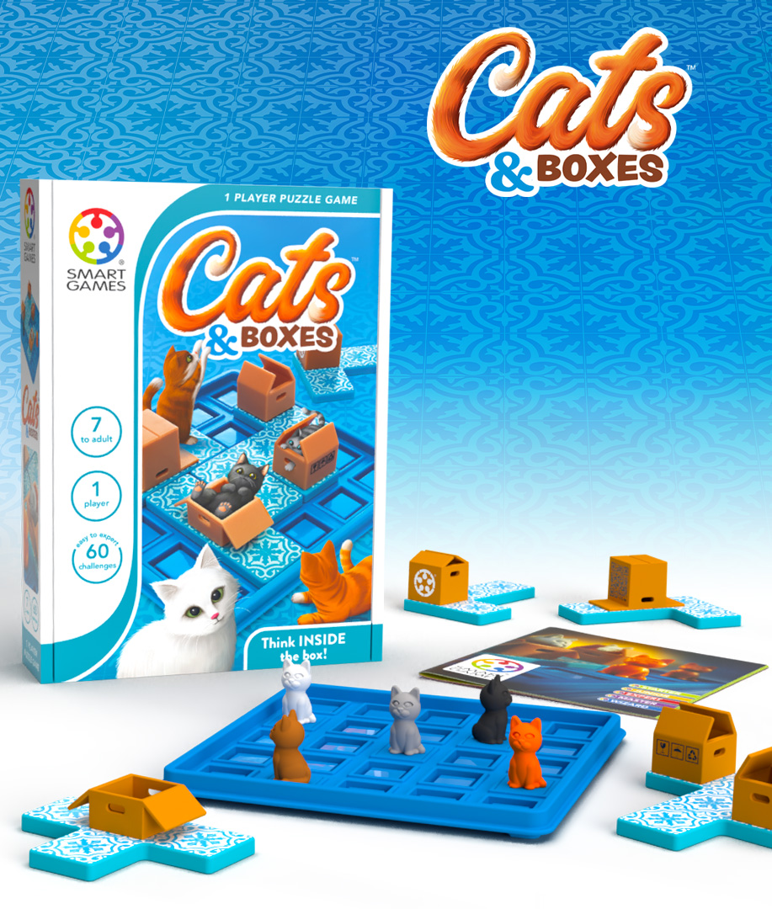
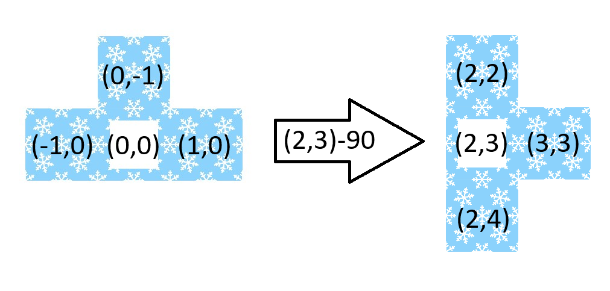
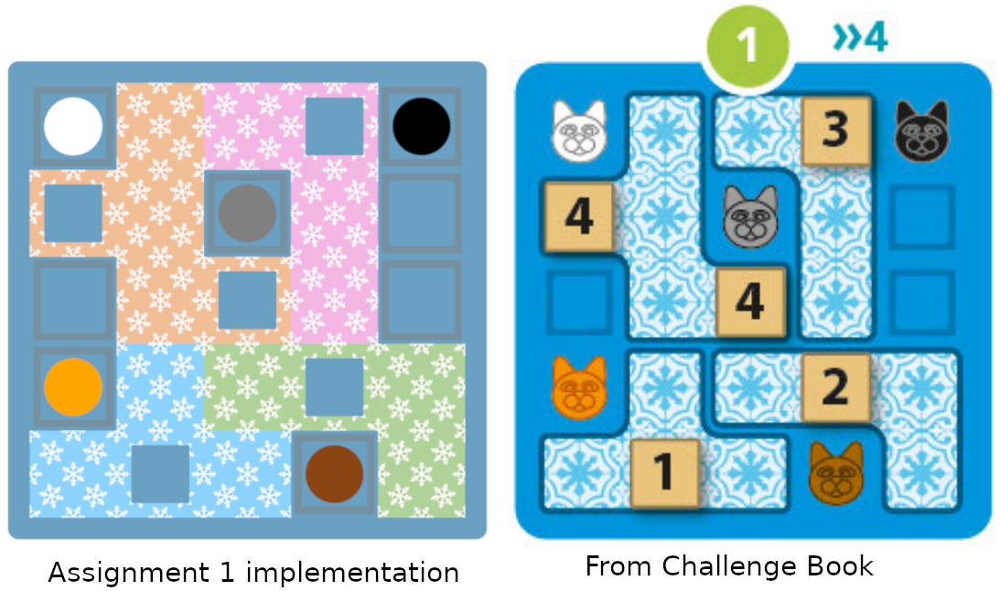

# COMP1110 Assignment 1

## Preface

We don't expect you to know all the content required for all parts of this assignment at the time of its release. You can start on the earlier tasks immediately, and the parts of Java you will need to complete the later tasks will be covered in weeks 2 and 3. Don't stress if you need to come back to them later.

Note that we also do _not_ expect all students to complete all parts of the assignment. The tasks listed under "Challenging" are _meant to be hard_, and they amount to a relatively small part of the total assignment mark.

## Academic Honesty and Integrity

Honesty and integrity are of utmost importance. These goals are *not* at odds
with being resourceful and working collaboratively. You *should* be resourceful,
and you may discuss the assignment
and other aspects of the course with others taking the class. However, the golden
rule is simple: **you must never misrepresent the work of others as your own**.

If you have taken ideas from
elsewhere or used code sourced from elsewhere, you must say so with *utmost
clarity*. At each stage of the assignment you will be asked to submit a statement
of originality, either as a group or as individuals. This statement is the place
for you to declare which ideas or code contained in your submission were sourced
from elsewhere.

Please read the ANU's [official position](http://academichonesty.anu.edu.au/) on
academic honesty. If you have any questions, please ask me.

Carefully review the [statement of originality](originality.yml) which you must
complete.  Edit that statement and update it as you complete the assignment,
ensuring that when you complete the assignment, a truthful statement is
committed and pushed to your repo.

## Purpose

This assignment is introductory, helping you gain familiarity with the basics
of Java, but doing so in the context of slightly larger piece of code.  Most of
the assignment is composed of a series of small tasks.

## Assignment Deliverable

The assignment is worth 5% of your total assessment, and it will be marked out
of 5. However, these marks are [redeemable](https://cs.anu.edu.au/courses/comp1110/assessments/redeemable/) by the exam,
so if your exam mark / 20 is higher than your assignment one mark, you will get the exam mark / 20 rather
than the assignment one mark. **The mark breakdown is described on the
[deliverables](https://cs.anu.edu.au/courses/comp1110/assessments/deliverables/#D1A) page.**

<!-- The assignment is due at **TIME HERE**, **DATE HERE**, giving you **NUMBER OF WEEKS HERE** weeks in which to complete it. -->  
You can find [the deadline](https://cs.anu.edu.au/courses/comp1110/assessments/deliverables/#D1A)
on the [deliverables page](https://cs.anu.edu.au/courses/comp1110/assessments/deliverables/), where all assignment deadlines for this semester are
listed.
Your tutor will mark your assignment by accessing your GitLab repository, so it is essential that you carefully follow
instructions for setting up and maintaining your repository. You will be marked
according to **whatever is committed to your repository at the time of the deadline**.
Please read the [course policy on deadlines](https://comp.anu.edu.au/courses/comp1110/policies/#deadlines).

## Overview
<!-- game pieces, objectives -->
The assignment is based on a simple children's puzzle called [Cats & Boxes](https://www.smartgames.eu/uk/one-player-games/cats-boxes),
made by [SmartGames](http://www.smartgames.eu/), a producer of educational games. The design of the game and all imagery in this assignment comes from their Cats & Boxes game.



**Figure 1: Cats and Boxes product photo**

The game comes with 60 pre-defined challenges, organised into 5 difficulty levels from Starter to Wizard. Each challenge defines the location of the cats and the initial placement of the box pieces.

The objective of the game is to move the other pieces so that all cats are in boxes, but picking up one piece at a time.

## Rules and terminology
<!-- rules of the game -->
Note: the following is adapted from the Cats and Boxes [challenge book](assets/SmartGames_Cats_Boxes_Challenge_Booklet.pdf). Terms which will be reused in the document are _italicised_.

The game starts by selecting a challenge difficulty level, with a specific _challenge_ chosen randomly from the unique challenges within each _difficulty level_. The challenge defines the starting positions of the _cats_ and the _boxes_.
The _boxes_ are part of larger _pieces_, which cannot overlap on the board. Once the game starts, you cannot move the cats. 

To play the game, you must move pieces one at a time until all the cats sit inside a box.

Pieces can be _translated_, that is moved horizontally and/or vertically, and _rotated_, which is a rotation around their main axis. We call these _transformations_.
The parts of a piece without a box cannot be placed over a cat, but once you place a cat in a box you are still free to move the piece again. 

Lower difficulty challenges only require moving each piece once, but harder challenges will require you to move pieces temporarily to make way for other pieces.


### Board


The board is defined as a 5 x 5 grid. Below is a depiction of the board, along with each absolute position's Cartesian coordinates:

|   |   |       |       |       |       |       |
|---|---|-------|-------|-------|-------|-------|
|   | x | 0     | 1     | 2     | 3     | 4     |
| y |   |       |       |       |       |       |
| 0 |   | (0,0) | (1,0) | (2,0) | (3,0) | (4,0) |
| 1 |   | (0,1) | (1,1) | (2,1) | (3,1) | (4,1) |
| 2 |   | (0,2) | (1,2) | (2,2) | (3,2) | (4,2) |
| 3 |   | (0,3) | (1,3) | (2,3) | (3,3) | (4,3) |
| 4 |   | (0,4) | (1,4) | (2,4) | (3,4) | (4,4) |

### Pieces

")

#### Relative and Absolute Positions
To define the location of a full piece, we use two positioning systems. _Absolute Positioning_ is used for the _origin_ (main square) of the piece, and is relative to (0,0) on the board (see Board table above).
_Relative Positioning_ is used for the piece segments, and is relative to the piece _origin_ (see Pieces diagram above). For the pieces that have only one box, the origin is always the sequare with the box; for Piece 4, which has two boxes, the origin is one of the boxes.

#### Transformations

The placement of each piece in the provided implementation is described by a type of linear transformation. The `Transform` class transforms a position to some other position. The following explanation of what a transformation does is sufficient for the purposes of this assignment, if you are additionally interested you can read more about the maths behind them [here](https://pages.mtu.edu/~shene/COURSES/cs3621/NOTES/geometry/geo-tran.html). 

In this assignment, a transformation (instance of the Transform class) is created (and defined) using a translation and a rotation. The translation is a pair of integers (see `IntPair` class). The rotation (clockwise) is an angle of one of 90, 180, 270 or 0 degrees (no rotation). In a transformation, the rotation is applied first around the position (0,0) then the translation is applied.

##### Transforming Points

To understand how this works we will consider the application of a transformation with translation (2,3) and a rotation of 90 degrees. To create this instance of the `Transform` class we would do:

```Transform transform1 = new Transform(new IntPair(2,3), Angle.DEG_90)```

We will consider applying this transform to just the point (1,1):

")

`transform1` rotates the point (1,1) 90 degrees to the point (-1,1). Then the translation is added to get the point (1,4). 

We can infer from the above diagram that if we transform the point (0,0) then any rotation in the transform has no effect. 


##### Transforming Pieces
 
The position of a piece in the game is defined by 'Relative Coordinates' which are each then transformed in the same way as the point in the previous example.

Consider applying `transform1` from the previous example to Piece 1.  



We have provided a method, applyTransform() in [Transform.java](src/comp1110/ass1/Transform.java) that does this for you. You do not need to fully understand how it works to complete the assignment.

Pieces are rotated _around their origin_. Conceptually, you can imagine holding the origin square of the piece in place and turning the whole piece clockwise around it.

## Encoding Challenges
<!-- any string/object encoding of game elements that should be explained -->
The list of challenges is encoded in [Challenge.java](src/comp1110/ass1/Challenge.java). Each challenge is specified as a precisely formatted string. This section describes how to interpret this string encoding. You will not have to do anything with this string encoding to complete the assignment, but we describe here for completeness, and because you will have to work with a string encoding (of a different game) in Assignment 2, so understanding how the provided methods that parse the string and create the corresponding objects work will be helpful to you later.

The encoding of each challenge contains the position of five the cats and the starting placement of the pieces. The starting placement of each piece is encoded as a transform in string form. 

Each **\<Challenge\>** has the form (where the pipe '|' means exclusive OR):

**Challenge ::= "\<Position<sub>WhiteCat</sub>\> \<Position<sub>BlackCat</sub>\> \<Position<sub>GreyCat</sub>\> \<Position<sub>OrangeCat</sub>\> \<Position<sub>BrownCat</sub>\>  \<Transform<sub>Piece1</sub>\> \<Transform<sub>Piece2</sub>\> \<Transform<sub>Piece3</sub>\> \<Transform<sub>Piece4</sub>\>"**

**Transform ::= "\<Position\>-\<Angle\>"**

**Position ::= "\<Integer\>,\<Integer\>"**

**Integer ::= "0" | "1" | "2" | "3" | "4"**

**Angle ::= "0" | "90" | "180" | "270"**


### Example: Challenge 1




Challenge 1 in the book is encoded as: 

```"0,0 4,0 2,1 0,3 3,4 1,4-0 3,3-180 3,0-270 0,1-0"```

Hence, the position of the white cat is (0,0), black cat (4,0) etc. "3,3-180" encodes the transform with translation (3,3) and rotation 180 degrees.

Note that this encoding does not include the numbers written on the pieces in the challenge book. Those numbers are hints, which indicate a suggested piece movement order.


### Your Task

The version of the assignment that we provide you has some missing code.
The graphical user interface is complete, and you can run the game, but
some of the important game logic is unimplemented, so it won't work as
described above. It is your job to fix these issues, so that the game works.

Each task (method with an incomplete implementation) is identified by a **FIXME** comment in the source code. You can use IntelliJ's "TODO" function to quickly locate these. The tasks are also provided as a list of issues in your assignment project on gitlab.
You should only fill in the missing parts in the indicated methods. Do not change any other parts of the code.

For convenience, the tasks are briefly listed here:

* Task 2: Implement the `add()` method in the `IntPair` class.
* Task 3: Implement the `withinBoard()` method in the `CatsAndBoxes` class.
* Task 4: Implement the `indexCorrespondsToBox()` method in the `Piece` class.
* Task 5: Implement the `randomChallenge()` method in the `Challenge` class.
* Task 6: Implement the `calcNewAbsolutePositions()` method in the `Piece` class.
* Task 7: Implement the `isSolution()` method in the `CatsAndBoxes` class.
* Task 8: Implement the `isMoveValid()` method in the `CatsAndBoxes` class.
* Task 9: Implement the `findAllValidMovesForPiece()` and `findAllValidMoves()` method in the `CatsAndBoxes` class.

With tasks 2, 4 and 6 completed, the game will look right and you will be able to move the pieces on the board. When tasks 2-8 are done, the game will be fully playable. (The two methods that make up task 9 are not needed to play the game, but are a useful starting point for implementing a method to solve the challenges automatically.)
In addition, unit tests are provided for each of the tasks. You can find these in the IntelliJ run configurations list. Use the unit tests to check your implementation of each of the methods.

## Legal and Ethical Issues

First, as with any work you do, you must abide by the principles of
[honesty and integrity](https://comp.anu.edu.au/courses/comp1110/policies/#academic-integrity).
We expect you to demonstrate honesty and integrity in everything you do.

In addition to those ground rules, you are to follow the rules one
would normally be subject to in a commercial setting. In particular,
you may make use of the works of others under two fundamental
conditions: a) your use of their work must be clearly acknowledged,
and b) your use of their work must be legal (for example, consistent
with any copyright and licensing that applies to the given material).
However, as long as you abide by these rules, you are
explicitly invited to conduct research and make use of a variety of
sources. You are also given an explicit means with which to declare
your use of other sources (via originality statements you must
complete). It is important to realize that you will be assessed on the
basis of your original contributions to the project. While you won't
be penalized for correctly attributed use of others' ideas, the work
of others will not be considered as part of your
contribution. Therefore, these rules allow you to copy another
student's work entirely if: a) they gave you permission to do so, and
b) you acknowledged that you had done so. Notice, however, that if you
were to do this you would have no original contribution and so would
receive no marks for the assignment (but you would not have broken any
rules either).

## Evaluation Criteria

**The mark breakdown is described on the
[deliverables](https://cs.anu.edu.au/courses/comp1110/assessments/deliverables/#D1A) page.**

The follow task numbers are associated with specific gitlab issues.

As part of fulfilling the requirements outlined on the deliverables page,
your job is to complete tasks #1 to #9 which are provided as gitlab issues.
Task #1 is set up and is not marked.

The tasks in the following categories are marked:

**Easy**

- Tasks #2, #3, #4

**Medium**
 
- Task #5, #6, #7

**Challenging**

- Task #8 and #9


**IMPORTANT NOTE:**
We do not expect that all students should complete all tasks. Anyone who engages with the course in the first weeks should be able to complete 50-60% (by marks) without extreme effort. Read the [FAQ](https://comp.anu.edu.au/courses/comp1110/help/faq/class/#why-are-the-assignments-so-time-consuming) on the topic.

*Remember that this assignment is redeemable via the final exam so don't stress if you are not able to complete all the tasks at this stage.*

## References 

- Piece segment image: https://depositphotos.com/62547653/stock-illustration-seamless-snowflake-pattern-winter-background.html
- Design and rules of the game: https://www.smartgames.eu/uk/one-player-games/cats-boxes 
